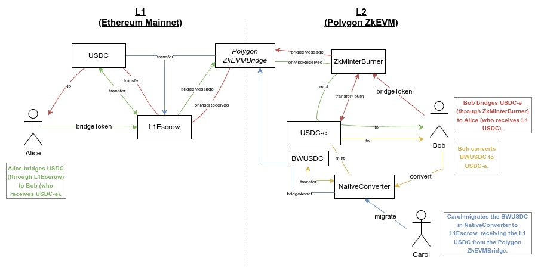

# USDC LXLY

## USDC LXLY Architecture and User Flows



[USDC-e LxLy](https://docs.google.com/document/d/1heUd3Cbux-ngnCJITbKJ9pdsz26BmNz1hfOn9NTuDH8/edit?pli=1)

## Contracts

- [**BridgedWrapped USDC**](https://zkevm.polygonscan.com/address/0xA8CE8aee21bC2A48a5EF670afCc9274C7bbbC035) (zkEVM) - existing token for USDC in zkEVM, created by the Polygon ZkEVMBridge using the default TokenWrapped ERC20 contract. 

- [**USDC-e**](https://zkevm.polygonscan.com/address/0x37eAA0eF3549a5Bb7D431be78a3D99BD360d19e5) (zkEVM) - "Native" USDC in zkEVM. This contract matches the current USDC contract deployed on Ethereum, with all expected features. The contract address is different from the current "bridge wrapped" USDC in use today, and has the ability to issue and burn tokens as well as "blacklist" addresses. [See USDC-e project](https://github.com/omnifient/usdc-e).

- [**L1Escrow**](https://etherscan.io/address/0x70E70e58ed7B1Cec0D8ef7464072ED8A52d755eB) (L1) - This contract receives L1 USDC from users, and triggers the ZkMinterBurner contract on zkEVM (through the Polygon ZkEVM Bridge) to mint USDC-e. It holds all of the L1 backing of USDC-e.
  It's also triggered by the Bridge to withdraw L1 USDC.

- [**ZkMinterBurner**](https://zkevm.polygonscan.com/address/0xBDa0B27f93B2FD3f076725b89cf02e48609bC189) (zkEVM) - This contract receives USDC-e from users on zkEVM, burns it, and triggers the L1Escrow contract on Ethereum Mainnet (through the Polygon ZkEVM Bridge) to transfer L1 USDC to the user.
  It's also triggered by the Bridge to mint USDC-e when the Bridge receives a message from the L1Escrow that a user has deposited L1 USDC.

- [**NativeConverter**](https://zkevm.polygonscan.com/address/0xd4F3531Fc95572D9e7b9e9328D9FEaa8e8496054) (zkEVM) - This contract receives BridgeWrappedUSDC on zkEVM and mints back USDC-e. It also has a permissionless publicly callable function called "migrate" which withdraws all BridgedWrappedUSDC to L1 through the Bridge. The beneficiary address is the L1Escrow, thus migrating the supply and settling the balance.

## Access Control

On Ethereum Mainnet the L1Escrow Admin & Owner are [this Safe wallet](https://app.safe.global/home?safe=eth:0xf694C9e3a34f5Fa48b6f3a0Ff186C1c6c4FcE904).

On the Polygon zkEVM the ZkMinterBurner and NativeConverter's Admin & Owner are [this Safe wallet](https://app.safe.global/home?safe=zkevm:0x2be7b3e7b9BFfbB38B85f563f88A34d84Dc99c9f).

- L1Escrow
  - Pauser/Unpauser
  - Admin Upgrader (via UUPS proxies)
  - Change Owner (which controls the ability to pause/unpause)
  - Change Admin (which controls the ability to upgrade the contracts)
- ZkMinterBurner
  - Pauser/Unpauser
  - Admin Upgrader (via UUPS proxies)
  - Change Owner (which controls the ability to pause/unpause)
  - Change Admin (which controls the ability to upgrade the contracts)
  - Minter of USDC-e (set by the USDC-e deploy script)
  - Burner of USDC-e (set by the USDC-e deploy script)
- NativeConverter
  - Pauser/Unpauser
  - Admin Upgrader (via UUPS proxies)
  - Change Owner (which controls the ability to pause/unpause)
  - Change Admin (which controls the ability to upgrade the contracts)
  - Minter of USDC-e (set by the USDC-e deploy script)
  - Burner of USDC-e (set by the USDC-e deploy script)
    - Note: `burn` is never used by the NativeConverter, only `mint`

## Flows

- User Bridges from L1 to zkEVM
  - User calls `bridgeToken()` on L1Escrow, L1_USDC transferred to L1Escrow, message sent to PolygonZkEVMBridge targeted to zkEVM’s ZkMinterBurner.
  - Message claimed and sent to ZkMinterBurner, which calls `mint()` on USDC-e, which mints new supply to the correct address.
- User Bridges from zkEVM to L1
  - User calls `bridgeToken()` on ZkMinterBurner which calls `burn()` on USDC-e, burning the supply. Message is sent to PolygonZkEVMBridge targeted to L1Escrow.
  - Message claimed and sent to L1Escrow, which transfers L1_USDC to the correct address.
- User converts BridgeWrappedUSDC to USDC-e
  - User calls `convert()` on NativeConverter, BridgeWrappedUSDC is transferred to NativeConverter. NativeConverter calls `mint()` on USDC-e, which mints new supply to the correct address.
  - Anyone can call `migrate()` on NativeConverter to have all BridgeWrappedUSDC withdrawn via the PolygonZkEVMBridge moving the L1_USDC held in the PolygonZkEVMBridge to L1Escrow.

## Testing and Deploying

First, copy `.env.example` to `.env` and set the appropriate environment variables (annotated with TODOs).

### Testing

1. Start anvil: two instances required, one for L1, and one for L2

```bash
# 1.1 start L1 (ethereum mainnet) anvil - NOTE: using port 8001 for L1
anvil --fork-url <https://eth-mainnet.g.alchemy.com/v2/YOUR_ALCHEMY_KEY> --chain-id 1 --port 8001 --fork-block-number 17785773

# 1.2 start L2 (polygon zkevm) anvil - NOTE: using port 8101 for L2
anvil --fork-url <https://polygonzkevm-mainnet.g.alchemy.com/v2/YOUR_ALCHEMY_KEY> --chain-id 1101 --port 8101 --fork-block-number 3172683
```

2. Deploy and initialize USDC-e in L2. Make sure you have the `usdc-e/` project configured.

```bash
cd usdc-e/
forge script script/DeployInitUSDCE.s.sol:DeployInitUSDCE --fork-url http://localhost:8101 --broadcast -vvvv
```

3. Copy the address to where USDC-e was deployed (to be used in the next step)

```bash
FiatTokenV2_1@0xe7f1725E7734CE288F8367e1Bb143E90bb3F0512
```

4. Set the USDC-e address into `usdc-lxly/.env`

```bash
cd usdc-lxly/
ADDRESS_L2_USDC=0xe7f1725E7734CE288F8367e1Bb143E90bb3F0512
```

5. Run the usdc-lxly tests

```bash
cd usdc-lxly/
forge test -v
```

### Deployment to Mainnet Forks

Note:

- using `0xf39Fd6e51aad88F6F4ce6aB8827279cffFb92266` as the admin for USDC-e
- using `0xa0Ee7A142d267C1f36714E4a8F75612F20a79720` as the admin+owner for L1Escrow, ZkMinterBurner, and NativeConverter contracts

A. Follow steps 1-4 from testing

B. deploy and initialize usdc-lxly

```bash
cd usdc-lxly/
forge script scripts/DeployInit.s.sol:DeployInit --broadcast -vvvv
```

### Deployment to Testnet/Mainnet

1. Deploy and initialize USDC-e in L2. Make sure you have the `usdc-e/` project configured.

```bash
cd usdc-e/
forge script script/DeployInitUSDCE.s.sol:DeployInitUSDCE --fork-url https://rpc.public.zkevm-test.net --broadcast -vvvvv
```

2. Copy the address to where USDC-e was deployed (to be used in the next step)

```bash
FiatTokenV2_1@0x00...000
```

3. Set the USDC-e address into `usdc-lxly/.env`

```bash
cd usdc-lxly/
ADDRESS_L2_USDC=0x00...000
```

4. deploy and initialize usdc-lxly

```bash
cd usdc-lxly/
forge script scripts/DeployInit.s.sol:DeployInit --broadcast --multi -vvvv
```

5. verify contracts

Use the `forge flatten` CLI tool to create a single Solidity file for each of the contracts deployed, and then use the Etherscan/Polygonscan Verification GUI to manually verify each contract.

[Etherscan Verification Tool](https://etherscan.io/verifyContract)

[Polygonscan Verification Tool](https://zkevm.polygonscan.com/verifyContract)

* Use "Solidity (Single File)" for the Compiler Type
* Use v0.8.17+commit.8df45f5f for the Compiler version
* Use "MIT" for Open Source License Type
* Select "Yes" from the Optimization dropdown
* When it asks for contract source code, copy+paste in the result of `forge flatten <path_to_solidity_file>` 
* When verifying one of the Proxy contracts which take constructor arguments, use [Hashex](https://abi.hashex.org/) to ABI-encode your constructor arguments. For the `bytes` constructor argument, simply leave the argument empty, do not pass "" as an argument, as that will be incorrect and your contract will not verify

6. test contracts

```bash
export PK=
export TESTER=
export L1_RPC=
export L2_RPC=https://rpc.public.zkevm-test.net
export L1_USDC=0x07865c6e87b9f70255377e024ace6630c1eaa37f
export L2_USDC=0x34919B92b0CD1B49D9A42c5eef3c3Bd26Bb2E04A
export L2_BWUSDC=0xA40b0dA87577Cd224962e8A3420631E1C4bD9A9f
export L1_ESCROW=0x0c404525ca97251EaB96140fff132C8D29B4F6A7
export MINTER_BURNER=0x70557De0922A8A207C74BeE79567B16751B9392F
export NATIVE_CONVERTER=0x5876A2FBAEbBD1F9530f764069d5CCE652767E61

#################################################
# DEPOSIT TO L1ESCROW
#################################################

# approve the l1escrow to spend 1 usdc
cast send --rpc-url $L1_RPC --private-key $PK $L1_USDC "approve(address,uint256)" $L1_ESCROW 1000000

# check allowance
cast call $L1_USDC "allowance(address,address)" $TESTER $L1_ESCROW --rpc-url $L1_RPC

# deposit
cast send --rpc-url $L1_RPC --private-key $PK $L1_ESCROW "bridgeToken(address,uint256,bool)" $TESTER 1000000 true

#################################################
# WITHDRAW FROM ZKMINTERBURNER
#################################################

# check usdc-e balance
cast call $L2_USDC "balanceOf(address)" $TESTER --rpc-url $L2_RPC

# check usdc-e total supply
cast call $L2_USDC "totalSupply()" --rpc-url $L2_RPC

# approve spending
cast send --rpc-url $L2_RPC --private-key $PK $L2_USDC "approve(address,uint256)" $MINTER_BURNER 1000000

# withdraw
cast send --rpc-url $L2_RPC --private-key $PK $MINTER_BURNER "bridgeToken(address,uint256,bool)" $TESTER 1000000 true

#################################################
# CONVERT
#################################################

# approve the native converter to spend 1 bw usdc
cast send --rpc-url $L2_RPC --private-key $PK $L2_BWUSDC "approve(address,uint256)" $NATIVE_CONVERTER 1000000

# convert 1 bw usdc to 1 usdc-e
cast send --rpc-url $L2_RPC --private-key $PK $NATIVE_CONVERTER "convert(address,uint256,bytes)" $TESTER 1000000 ""

#################################################
# MIGRATE
#################################################
cast send --rpc-url $L2_RPC --private-key $PK $NATIVE_CONVERTER "migrate()"
```
